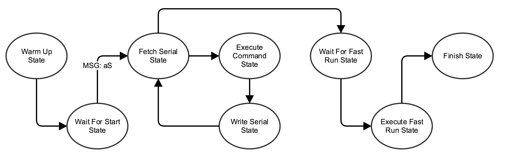

# MDP17

## TODO

## Communication Protocol
Prefix | To Destination
--- | ---
**p** | PC (Algorithm)
**a** | Arduino
**b** | Bluetooth

1. Control Command to Arduino (with prefix **a**)

  Prefix | Direction | Amount
  --- | --- | ---
  **a** | **F** (move forward) | uint_8
  **a** | **B** (move backward) | uint_8
  **a** | **C** (rotate clockwise) | uint_8
  **a** | **A** (rotate anti-clockwise) | uint_8
  **a** | **S** (Wait For Start State -> Fetch Serial State) | NA
  **a** | **Z** (calibrate N grids away) | uint_8
  
  Example: 

  `aF5C1`: Move forward 5 grids, then immediately rotate clockwise for 90 degree. 

1. Sensor Feedback to PC (with prefix **p**)

  Special Characters:
  * ~~'O' Reading out of bound~~
  * '9' Reading out of bound @voducvan

  Byte | Meaning | Range
  --- | --- | ---
  0 | 'p' for PC as Destination | NA
  1 | IR Short Front Left | 1-4, 9
  2 | IR Short Front Center | 1-4, 9
  3 | IR Short Front Right | 1-4, 9
  4 | IR Left Side | 1-6, 9
  5 | Ultrasonic Left Side | 0, 1
  6 | Ultrasonic Right Side | 0, 1
  7 | '\0'

  Example: 
  
  `p123401`: 

## Arduino
### State Diagram
  

